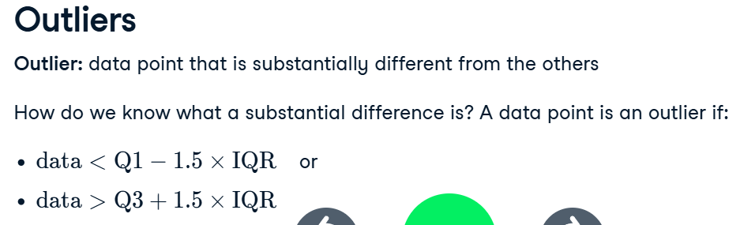

# Introduction to Statistics

## Measures of center

Assume we have a dataset called `msleep` and in the dataset we have a column called `sleep_total`.

**Mean:**
```python
import numpy as np
np.mean(msleep['sleep_total'])
# or
XXX.mean()
```

**Median:** Sort values first and then take the middle one (in our example the middle one is 41) or use numpy.
```python
import numpy as np
msleep['sleep_total'].sort_values().iloc[41]
# or
np.median(msleep['sleep_total'])
```

**Mode:** Most frequent value.
```python
msleep['sleep_total'].value_counts()
# or
import statistics
statistics.mode(msleep['sleep_total'])
```

The code below gives you **mean** and **median** at the same time:
```python
import numpy as np
XXX.agg([np.mean, np.median])
```

## Measures of spread

**Variance:** How spread out the data is.
```python
import numpy as np
np.var(XXX, ddof=1)
```
> Without `ddof=1`, population variance is calculated instead of sample variance.

**Standard deviation:**
```python
import numpy as np
np.std(XXX, ddof=1)
```

**Mean absolute deviation:** Takes the absolute value of the distances to the mean and then takes the mean of those differences.
```python
import numpy as np
dists = msleep['sleep_total'] - mean(msleep['sleep_total'])
np.mean(np.abs(dists))
```
> `std` squares distances, penalizing longer distances more than shorter ones.  
> Mean absolute deviation penalizes each distance equally.

**Quantiles:**
```python
import numpy as np
np.quantile(msleep['sleep_total'], 0.5)
```
Taking the 0.5 quantile (i.e., median), but we can take multiple quartiles at the same time. Boxplots use quartiles. You can use `np.linspace` to split quantiles.

**IQR (Interquartile range):**
```python
import numpy as np
np.quantile(msleep['sleep_total'], 0.75) - np.quantile(msleep['sleep_total'], 0.25)
# or
from scipy.stats import iqr
iqr(msleep['sleep_total'])
```



**Example code:**
```python
# Print variance and sd of co2_emission for each food_category
print(food_consumption.groupby('food_category')['co2_emission'].agg([
    np.var, np.std]))
```
`groupby` groups the data by each food category.

```python
# Calculate total co2_emission per country: emissions_by_country
emissions_by_country = food_consumption.groupby('country')['co2_emission'].sum()

# Compute the first and third quantiles and IQR of emissions_by_country
q1 = np.quantile(emissions_by_country, 0.25)
q3 = np.quantile(emissions_by_country, 0.75)
iqr = q3 - q1

# Calculate the lower and upper cutoffs for outliers
lower = q1 - 1.5 * iqr
upper = q3 + 1.5 * iqr

# Subset emissions_by_country to find outliers
outliers = emissions_by_country[(emissions_by_country < lower) | 
                                (emissions_by_country > upper)]
print(outliers)
```
## Measuring chance
```python
xxx.sample()
```
sample method picks randomly. If we want to get the same result after each generating, we can use random.seed()
```python
np.random.seed(10)
xxx.sample()
```
the number doesn't matter.
Noe we want to have sampling with or without replacement.
```python
xxx.sample(n)
xxx.sample(n, replace=True)
```
n is the numbe rof samples you have.
An example:
You're in charge of the sales team, and it's time for performance reviews, starting with Amir. As part of the review, you want to randomly select a few of the deals that he's worked on over the past year so that you can look at them more deeply. Before you start selecting deals, you'll first figure out what the chances are of selecting certain deals.
```python
# Count the deals for each product
counts = amir_deals['product'].value_counts()

# Calculate probability of picking a deal with each product
probs = amir_deals['product'].value_counts(normalize=True)
print(probs)
```
Sampling deals
In the previous exercise, you counted the deals Amir worked on. Now it's time to randomly pick five deals so that you can reach out to each customer and ask if they were satisfied with the service they received. You'll try doing this both with and without replacement.

Additionally, you want to make sure this is done randomly and that it can be reproduced in case you get asked how you chose the deals, so you'll need to set the random seed before sampling from the deals.
```python
# Set random seed
np.random.seed(24)

# Sample 5 deals without replacement
sample_without_replacement = amir_deals.sample(5)
print(sample_without_replacement)
# Sample 5 deals with replacement
sample_with_replacement = amir_deals.sample(5,replace=True)
print(sample_with_replacement)
```
## Discrete distributions
A new restaurant opened a few months ago, and the restaurant's management wants to optimize its seating space based on the size of the groups that come most often. On one night, there are 10 groups of people waiting to be seated at the restaurant, but instead of being called in the order they arrived, they will be called randomly. In this exercise, you'll investigate the probability of groups of different sizes getting picked first. Data on each of the ten groups is contained in the restaurant_groups DataFrame.
Task:Count the number of each group_size in restaurant_groups, then divide by the number of rows in restaurant_groups to calculate the probability of randomly selecting a group of each size. Save as size_dist.
Reset the index of size_dist.
Rename the columns of size_dist to group_size and prob.
Calculate the expected value of the size_dist, which represents the expected group size, by multiplying the group_size by the prob and taking the sum.
Calculate the probability of randomly picking a group of 4 or more people by subsetting for groups of size 4 or more and summing the probabilities of selecting those groups.
```python
# Create probability distribution
size_dist = restaurant_groups["group_size"].value_counts() / restaurant_groups.shape[0]

# Reset index and rename columns
size_dist = size_dist.reset_index()
size_dist.columns = ['group_size', 'prob']

# Expected value
expected_value = np.sum(size_dist['group_size'] * size_dist['prob'])

# Subset groups of size 4 or more
groups_4_or_more = size_dist[size_dist['group_size'] >= 4]

# Sum the probabilities of groups_4_or_more
prob_4_or_more = groups_4_or_more['prob'].sum()
print(prob_4_or_more)
```
## Continuous distributions
**Uniform  distribution in python**
$P(x \leq 7)$, from 0 to 12
```python
from scipy.stats import uniform
uniform.cdf(7,0,12)
```
**Generating random numbers according to uniform distribution**
```python
from scipy.stats import uniform
uniform.rvs(0,5,size=10)
```
so we generated 10 random numbers in the range $[0,5]$.
Task:
The sales software used at your company is set to automatically back itself up, but no one knows exactly what time the back-ups happen. It is known, however, that back-ups happen exactly every 30 minutes. Amir comes back from sales meetings at random times to update the data on the client he just met with. He wants to know how long he'll have to wait for his newly-entered data to get backed up. Use your new knowledge of continuous uniform distributions to model this situation and answer Amir's questions.
Q1:To model how long Amir will wait for a back-up using a continuous uniform distribution, save his lowest possible wait time as min_time and his longest possible wait time as max_time. Remember that back-ups happen every 30 minutes.
```python
# Min and max wait times for back-up that happens every 30 min
min_time = 0
max_time = 30
```
Q2: Import uniform from scipy.stats and calculate the probability that Amir has to wait less than 5 minutes, and store in a variable called prob_less_than_5.
```python
# Import uniform from scipy.stats
from scipy.stats import uniform

# Calculate probability of waiting less than 5 mins
prob_less_than_5 = uniform.cdf(5,0,30)
print(prob_less_than_5)
```
Q3:
Calculate the probability that Amir has to wait more than 5 minutes, and store in a variable called prob_greater_than_5.
```python
# Calculate probability of waiting more than 5 mins
prob_greater_than_5 = 1- uniform.cdf(5,0,30)
print(prob_greater_than_5)
```
Q4:Calculate the probability that Amir has to wait between 10 and 20 minutes, and store in a variable called prob_between_10_and_20.
```python
# Calculate probability of waiting 10-20 mins
prob_between_10_and_20 = uniform.cdf(20,0,30)-uniform.cdf(10,0,30)
print(prob_between_10_and_20)
```
## The binomial distribution
If we are flipping coins.
binom.rvs(# of coins, probability of heads/success, size=# of trials)
1 = head, 0 = tails
```python
from scipy.stats import binom
binom.rvs(1,0.5,size=1)
```
How do we get the probability of 7 heads?
```python
binom.pmf(7,10,0.5)
```
10 is the number of trials.
What is the probability of 7 or fewer heads?
```python
binom.cdf(7,10,0.5)
```
## The normal distribution
```python
from scipy.stats import norm
norm.cdf(a,m,s)
norm.ppf(b,m,s)
norm.rvs(m,s,size=sample size we want)
```
m=mean,s=standard deviation, a=number of interest, b=percentage.
Task:
Since each deal Amir worked on (both won and lost) was different, each was worth a different amount of money. These values are stored in the amount column of amir_deals and follow a normal distribution with a mean of 5000 dollars and a standard deviation of 2000 dollars. As part of his performance metrics, you want to calculate the probability of Amir closing a deal worth various amounts.
Q1:What's the probability of Amir closing a deal worth less than $7500?
```python
# Probability of deal < 7500
prob_less_7500 = norm.cdf(7500,5000,2000)
print(prob_less_7500)
```
Q2: What's the probability of Amir closing a deal worth more than $1000?
```python
# Probability of deal > 1000
prob_over_1000 = 1- norm.cdf(1000,5000,2000)
print(prob_over_1000)
```
Q3:What's the probability of Amir closing a deal worth between $3000 and $7000?
```python
# Probability of deal between 3000 and 7000
prob_3000_to_7000 = norm.cdf(7000,5000,2000)-norm.cdf(3000,5000,2000)
print(prob_3000_to_7000)
```
Q4:What amount will 25% of Amir's sales be less than?
```python
# Calculate amount that 25% of deals will be less than
pct_25 = norm.ppf(0.25,5000,2000)
print(pct_25)
```
Task:The company's financial analyst is predicting that next quarter, the worth of each sale will increase by 20% and the volatility, or standard deviation, of each sale's worth will increase by 30%. To see what Amir's sales might look like next quarter under these new market conditions, you'll simulate new sales amounts using the normal distribution and store these in the new_sales DataFrame, which has already been created for you.
Currently, Amir's average sale amount is 5000. Calculate what his new average amount will be if it increases by 20% and store this in new_mean.
Amir's current standard deviation is $2000. Calculate what his new standard deviation will be if it increases by 30% and store this in new_sd.
Create a variable called new_sales, which contains 36 simulated amounts from a normal distribution with a mean of new_mean and a standard deviation of new_sd.
Plot the distribution of the new_sales amounts using a histogram and show the plot.
```python
# Calculate new average amount
new_mean = 5000*1.2

# Calculate new standard deviation
new_sd = 2000*1.3

# Simulate 36 new sales
new_sales = norm.rvs(new_mean,new_sd,size=36)

# Create histogram and show
plt.hist(new_sales)
plt.show()
```
Task:The key metric that the company uses to evaluate salespeople is the percent of sales they make over $1000 since the time put into each sale is usually worth a bit more than that, so the higher this metric, the better the salesperson is performing.
Recall that Amir's current sales amounts have a mean of 5000 and a standard deviation of 2000, and Amir's predicted amounts in next quarter's market have a mean of 6000 and a standard deviation of 2600.
norm from scipy.stats is imported.
Based only on the metric of percent of sales over 1000, does Amir perform better in the current market or the predicted market?
```python
from scipy.stats import norm

# Current market parameters
current_mean = 5000
current_sd = 2000
current_prob_over_1000 = 1 - norm.cdf(1000, loc=current_mean, scale=current_sd)

# Predicted market parameters
predicted_mean = 6000
predicted_sd = 2600
predicted_prob_over_1000 = 1 - norm.cdf(1000, loc=predicted_mean, scale=predicted_sd)

# Print the results
print(f"Current market: {current_prob_over_1000:.4f} probability of sale > $1000")
print(f"Predicted market: {predicted_prob_over_1000:.4f} probability of sale > $1000")
```
conclusion:In the current market, Amir makes sales over $1000 about 97.7% of the time, and about 97.3% of the time in the predicted market, so there's not much of a difference. However, his average sale amount is higher in the predicted market, so your company may want to consider other metrics as well.
## The central limit theorem
The sampling distribution of a statistic becomes closer to the normal distribution as the number of trials increases.
Task:Create a histogram of the num_users column of amir_deals and show the plot.
```python
amir_deals['num_users'].hist()
plt.show()
```
Task: Set the seed to 104.
Take a sample of size 20 with replacement from the num_users column of amir_deals, and take the mean.Repeat this 100 times using a for loop and store as sample_means. This will take 100 different samples and calculate the mean of each.Convert sample_means into a pd.Series, create a histogram of the sample_means, and show the plot.
```python
# Set seed to 104
np.random.seed(104)

# Sample 20 num_users with replacement from amir_deals and take mean
samp_20 = amir_deals['num_users'].sample(20, replace=True)
np.mean(samp_20)

sample_means = []
# Loop 100 times
for i in range(100):
  # Take sample of 20 num_users
  samp_20 = amir_deals['num_users'].sample(20, replace=True)
  # Calculate mean of samp_20
  samp_20_mean = np.mean(samp_20)
  # Append samp_20_mean to sample_means
  sample_means.append(samp_20_mean)
  
print(sample_means)
sample_means_series = pd.Series(sample_means)
sample_means_series.hist() 
plt.show()
```
## The Poisson distribution
Poisson process is a process where events appear to happen at a certain rate but completely at random. The Poisson distribution describes the probability of some number of events happening over a fixed period of time. 
```python
from scipy.stats import poisson
poisson.pmf(x,lambda) #gives the probability of a single value
poisson.cdf(x,lambda) #gives the probability of less than or equal to
poisson.rvs(lambda, size=x)
```
lambda:the average of the events.
## More probability distributions
**Exponential distribution**: probability of a certain time passing between Poisson events.
```python
from scipy.stats import expon
expon.cdf(x,scale=1/lambda)
```
lambda is the expected value of the exponential distribution.
## Correlation
Visualizing relationships:
```python
import seaborn as sns
sns.scatterplot(x='name of x axis', y='name of y axis', data=dataname)
#adding a trendline:
sns.lmplot(x='name of x axis', y='name of y axis', data=dataname, ci=None)
```
Computing correlation:
```python
data['column_1'].corr(data['column_2'])
```
Task:
In this exercise, you'll examine the relationship between a country's life expectancy (life_exp) and happiness score (happiness_score) both visually and quantitatively. 
Q1:Create a scatterplot of happiness_score vs. life_exp (without a trendline) using seaborn.
Show the plot.
```python
# Create a scatterplot of happiness_score vs. life_exp and show
sns.scatterplot(y='happiness_score',x='life_exp', data=world_happiness)

# Show plot
plt.show()
```
Q2:Create a scatterplot of happiness_score vs. life_exp with a linear trendline using seaborn, setting ci to None.
Show the plot.
```python
# Create scatterplot of happiness_score vs life_exp with trendline
sns.scatterplot(y='happiness_score',x='life_exp', data=world_happiness)
sns.lmplot(y='happiness_score',x='life_exp', data=world_happiness,ci=None)
# Show plot
plt.show()
```
Q3:Calculate the correlation between life_exp and happiness_score. Save this as cor.
```python
# Correlation between life_exp and happiness_score
cor = world_happiness['life_exp'].corr(world_happiness['happiness_score'])
```
## Correlation caveats
**log transformation**: log the data when data is highly skewed.
or square root transformation, reciprocal transformation.