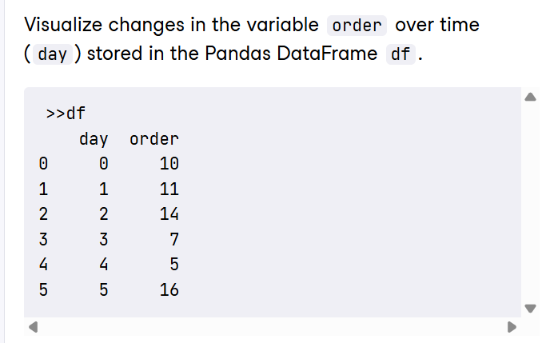

# Data Manipulation with Python
**Q1**: The **chess** DataFrame contains information about the top female chess players around the world. Determine what fields exist in the dataset by printing the names of the columns.
```python
print(chess.columns)
```
**Q2**:
```python
import matplotlib.pyplot as plt
import seaborn as sns

sns.lineplot(x='day',y='order',data=df)
plt.xticks(rotation=45)
plt.show()
```
**Q3**: Create a swarm plot of **value** as a function of **measurement**. Use the color to indicate the **species**. The data is contained in the **iris** DataFrame.
```python
import matplotlib.pyplot as plt
import seaborn as sns

ax = sns.swarmplot(x='measurement',y='value',hue='species',data=iris)
plt.show()
```
**Q4**: You are investigating the impact of **age** on the **valuation** of cars to better understand prices that should be offered to customers for second hand cars. You want to visualize both the individual distributions as well as the relationship between the two variables on a single graphic.
```python
import matplotlib.pyplot as plt
import seaborn as sns

sns.jointplot(x='age', y='value',data=valuation)
plt.show()
```
**Q5**: The human resources manager is interested in knowing the number of candidates from different educational backgrounds in the job application pool. Visualize the counts for each value in the **education** column of the **candidates** DataFrame.
```python
import matplotlib.pyplot as plt
import seaborn as sns

sns.countplot(x='education', data = candidates)
plt.show()
```
**Q6**: In preparation for an upcoming staffing review, your manager has asked you to sort the records of **employee** DataFrame by **gender** alphabetically, and then by **salaries** in descending order
```python
employee_sorted = employee.sort_values(['gender','salary'],ascending = [True, False])
print(employee_sorted)
```
**Q7**:You work for a second hand car sales company, and they want to know the relationship between the **age** and the **value** so that they can estimate the best price to sell their cars at. Create a plot to show the relationship, identifying the miles per gallon(mpg) by changing the size of each point. Use the **valuation** data.
```python
import matplotlib.pyplot as plt
import seaborn as sns

sns.scatterplot(x='age',y='value', size = 'mpg', data = valuation)
plt.show()
```
**Q8**: Using the **food** DataFrame, print the rows where **protein** per 100g is between, but not including, 4 and 10. Ensure the data is sorted based on the **energy** values, in ascending order.
```python
cond1 = food['protein'] < 10
cond2 = food['protein'] > 4
food_subset = food[cond1 & cond2]
print(food_subset.sort_values(by='energy'))
```
**Q9**: The data **monthly_count** has been indexed based on the **month**. Update the index to include February.
```python
all_months = ['January','February','March', 'April']
updated_monthly=monthly_count.reindex(all_months)
print(updated_monthly)
```
**Q10**: You want to use **loc** to slice the **food** DataFrame, to return the values from **croissant** to **thai_curry**. Sort by item alphabetically first.
```python
food_sort = food_sort_index()
print(food_sort.loc['croissant':'thai_curry'])
```
**Q11**: The **wine** DataFrame, contains rating information for a number of wines on offer from an online retailer. Create a pivot table to show the minimum **rating**, for each **type** and **country**.
```python
import numpy as np

min_ratings = wine.pivot_table(values = 'rating', index='country', columns = 'type', aggfunc=np.min)
print(min_ratings)
```
**Q12**:The **wine** DataFrame, contains rating information for a number of wines on offer from an online retailer. Create a pivot table to show the maximum **rating**, for each **type** and **country**.
```python
import numpy as np

max_ratings = wine.pivot_table(values = 'rating', index='country', columns = 'type', aggfunc=np.max, margins=True)
print(max_ratings)
```
**Q13**:The **wine** DataFrame provides the retai price for a number of different wines that you want to buy. What is the total **price** you would have to pay for each **type** of wine?
```python
total_price_by_type = wine.groupby('type')['price'].sum()
print(total_price_by_typ)
```
**Q14**:Return the second and third columns of the DataFrame **df**
```python
print(df.iloc[:,1:3])
```
**Q15**:From the DataFrame **df**, return all females whose salary is greater than 5000.
```python
result = df[(df['salary']>5000) & (df['gender']=='female')]
print(result)
```